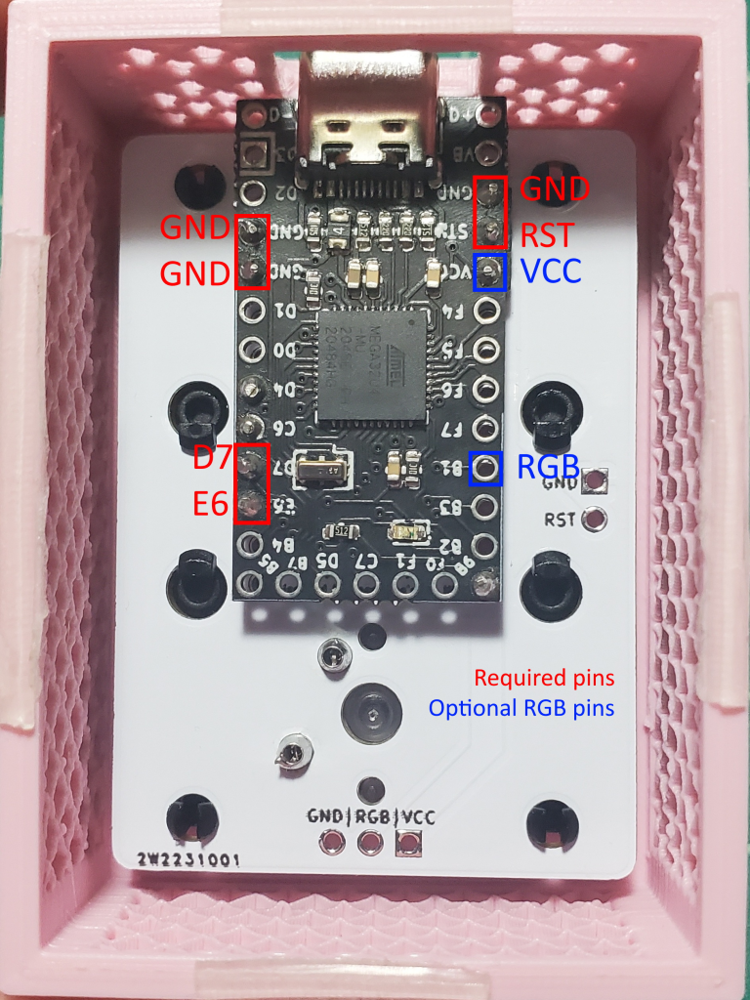

# Milk Crate

Another milk-themed meme board, for your extra unused base kit/novelty ISO keys. Inspired by [Spaceboards/2% Milk](https://github.com/Spaceman/Spaceboards/tree/master/Keyboards/2%25%20Milk).

## Build Notes

### Printing

Print upside down slowly at ≤0.2mm layer height, with supports enabled.

### Assembly

Essentially the same as 2% Milk. I reccomend flasing the firmware to the Pro Micro before assembly.

1. Put switches into the top of the case. With the port on the left, the left switch is north facing, and the right switch is south facing. 
2. Break apart the headers to only use the required pins in the diagram below.
3. Solder short header pins to the side that says "GET SOME MILK". The plastic headers should be on the "MILK CRATE" side.
4. Insert stabilizers into the PCB. Hook side goes in to the big hole, clip/screw goes into the small hole.
5. Optionally solder RGB LED to the broken out RGB pins.
6. Insert the PCB into the case, then solder the switches.
7. Solder the Pro Micro to the header pins, making sure that the electronics are facing up.
8. Install ISO keycaps, and enjoy :)

